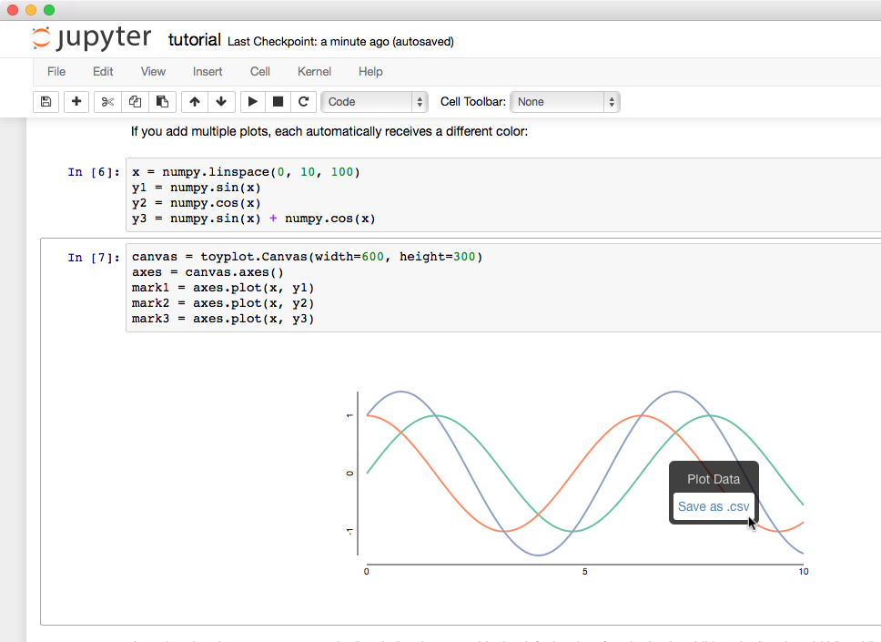
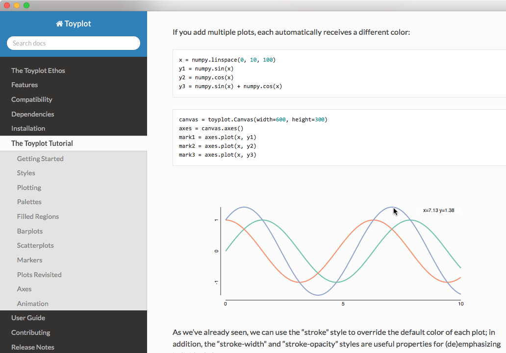

.. image:: ../artwork/toyplot.png
  :width: 200px
  :align: right

.. _embedding:

Embedding
=========

We like to say that "Toyplot figures are beautiful, scalable,
embeddable, and interactive", but what does *embeddable* really mean,
anyway? Scientists and engineers are already accustomed to embedding
static images in their publications and presentations, so what does
embedding in Toyplot have to offer that other tools don't?

In a word: interaction.

In their native HTML + Javascript format, Toyplot figures are
interactive - users can mouse over the figure to see interactive
coordinates and even extract the data from a figure in CSV format using
a context menu. This is just scratching the surface of what we want to
achieve in interactivity, but the key point is that each figure is
*completely self contained* and can be distributed as a single file
without any need for an external server, special libraries or
stylesheets.

Here are just a few examples of Toyplot embedding in-action:

Jupyter (IPython) Notebooks
---------------------------

To use Toyplot in a Jupyter (IPython) notebook, simply import the
library and create a plot - no magics or backends required. The library
knows that it's being executed in the Jupyter environment, and
automatically renders the plot into your notebook using the interactive
HTML format:

"This is all well and good", you may say, "and the interaction is nice,
but it's hardly a game-changer".

But wait! This is where the self-contained nature of Toyplot figures really
starts to shine.  For example, if you use the notebook's `File > Download as >
HTML (.html)` menu command, your browser will download an HTML copy of the
notebook, with the Toyplot figures embedded, as you might expect.  What you
might `not` expect is that the figures will still be live and interactive!

Slides
------

As another example, you can convert your Jupyter notebook into an interactive
`Reveal.js <http://lab.hakim.se/reveal-js/#>`_ presentation using the nbconvert
utility, and the embedded Toyplot figures in your slides will retain their
interaction for your presentation:

``ipython nbconvert --to slides mynotebook.ipynb --output mynotebook.slides.html``

Imagine being able to respond to audience questions with a live figure that was
authored in a completely separate environment!

Documentation
-------------

Similarly, you can convert your notebook to restructured text (the markup of
choice for most Python documentation):

::

    $ ipython nbconvert --to rst mynotebook.ipynb --output mynotebook.rst

and the HTML Toyplot figures will be embedded in the restructured text and remain
fully-interactive in the generated docs. This, by the way, is how most of the
Toyplot documentation is written, including the page that you're reading - we
author examples using Jupyter notebooks, which are converted to .rst files,
then compiled into HTML documentation using `Sphinx <http://sphinx-doc.org>`_:

Electronic Publication
----------------------

This leads us to one of the key goals of the Toyplot authors: supporting
electronic publication, and changing authors' and viewers' expectations for
data graphics.  Many scientific and engineering journals have begun to
experiment with HTML-based publishing formats, and figures created with Toyplot
are uniquely suited to an HTML publishing environment, providing useful
interaction in a completely self-contained "package" that trivially inserted
into an HTML document without additional modification.  Because the Toyplot
figures don't rely on external libraries or stylesheets, they can be embedded,
copied, and moved from place-to-place where they will Just Work without
modification.

E-Mail
------

Because a Toyplot figure is fully self-contained, it can be easily
shared through e-mail or other electronic communication channels. You
can e-mail a Toyplot .html file to a colleague, and they will be able to
easily view and interact with the file, in many cases right inside their
e-mail client:

PyQT / PySide
-------------

Because the Qt graphical user interface includes a fully-featured WebKit
browser and Python bindings (PyQt or PySide, take your pick), you can
embed interactive Toyplot plots in just a few lines of code, with all
the interaction intact:

.. code:: python

    window = QWebView()
    canvas, axes, mark = toyplot.plot(x, y)
    window.setHtml(xml.etree.ElementTree.tostring(toyplot.html.render(canvas), method="html"))

If you prefer, you could also embed static plots using the SVG or PNG
backends:

.. code:: python

    window.setContent(xml.tostring(toyplot.svg.render(canvas)), "image/svg+xml")

or

.. code:: python

    window.setContent(toyplot.png.render(canvas), "image/png")

Automated Embedding
-------------------

Toyplot provides a wide variety of rendering backends in addition to the preferred,
interactive HTML + Javascript backend.  The API implemented by the backends has been
carefully crafted to support embedding and maximize consistency:

* Most backends take a `fileobj` parameter in their :meth:`render` method.  If you pass a string `fileobj`, the canvas will be written to the given filename on disk using whatever file format (HTML, SVG, PDF, PNG, etc.) the backend implements.
* If you pass a file-like object as the `fileobj` parameter, the canvas to the object in the backend file format.  So you could use :class:`StringIO.StringIO` to store a figure to an in-memory buffer for subsequent processing.
* If you don't supply the `fileobj` parameter, the canvas will be returned from :meth:`render` in whatever form is most appropriate for the file format:
    * The HTML and SVG backends return an instance of :class:`xml.etree.ElementTree.Element` that contains the figure DOM.  This makes it easy to manipulate the tree for embedding in a larger tree or subsequent processing.
    * The PDF and PNG backends return the raw bytes of the PDF or PNG file.  So you could pass the PNG image bytes to :mod:`PIL`, for example.

