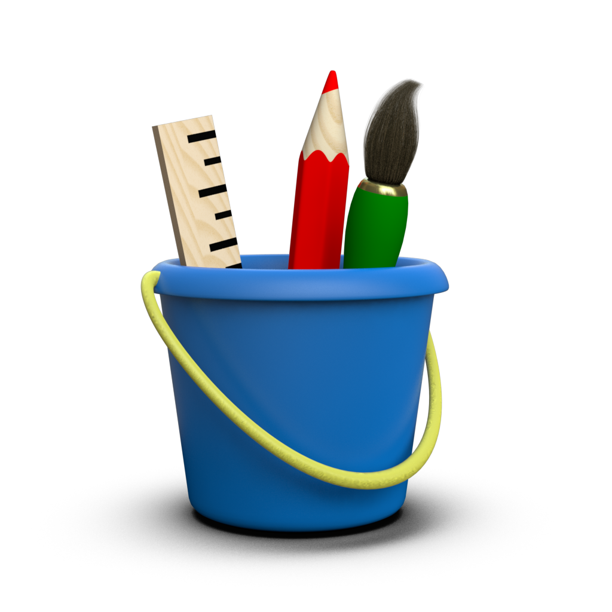

.. _ethos:

The Toyplot Ethos
=================

What began as a quick workaround to reduce the size of animations in IPython
quickly grew into Toyplot, "the kid-sized plotting toolkit with grownup-sized
goals".  In a nutshell, we think that scientists and engineers should expect
more from their plots: more interaction, more reproducibility, greater clarity,
and better aesthetics.

We especially feel that, in an age of ubiquitous electronic media and the web,
it makes little sense to publish using media (such as PDF) designed to mimic
the limitations of static paper.  Toyplot embraces the tools of the web - SVG,
HTML, and Javascript - as its primary medium, so we can make useful new
interactions part of the everyday experiences of data graphic users.  Because
we're passionate about publishing and sharing results, Toyplot graphics are
completely self-contained and embeddable, without the need for a server.  All
of the Toyplot graphics you see in these pages are live and interactive,
despite the fact that they were created offline in an IPython notebook and
passed through several publishing steps on the way to becoming our
documentation.  Of course, we provide backends to publish Toyplot figures
to legacy formats including PNG, PDF, Encapsulated Postscript, and MP4.

Interactivity includes obvious things such as zooming and panning.  But beyond
that, Toyplot is exploring ideas from efficient animation that doesn't impact
the quality of the graphic to interactive data cursors that display quantities
of interest and descriptive statistics by pointing at the figure.  And since
the raw data is already implicitly embedded in a graphic, why not support
reproducibility by making it easy to export, so the viewer can work with it
themselves?  That's why Toyplot has a context menu to export raw data from a
figure in CSV format.

Last but definitely not least: Toyplot fully embraces principles and best
practices for clarity and aesthetics in data graphics that are well-established
by the visualization community, yet sadly lacking in contemporary plotting
libraries.  Toyplot has beautiful color palettes and sensible default styling
that minimize chartjunk and maximize data ink out of the box, not as
afterthoughts or addons.

